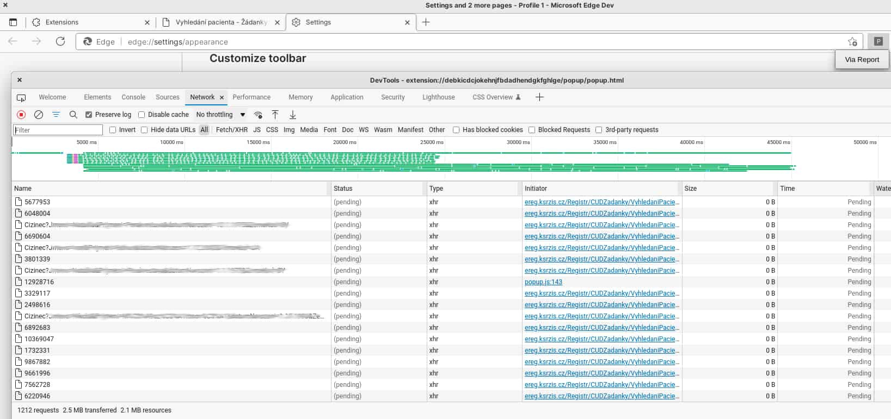
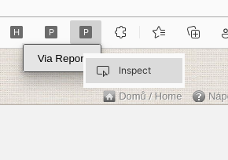

# PRO OC Profile fixer



Rozšíření do prohlížeče obsahující automatický skript, který prochází přiložené Covid-19 žádanky a opravuje k nim asociované profily pacientů v modulu [Pacienti COVID-19](https://ereg.ksrzis.cz/Registr/CUDZadanky/VyhledaniPacienta), které jsou pro pacienty dostupné z webové stránky [ocko.uzis.cz](https://ocko.uzis.cz) nebo mobilní aplikace [Tečka](https://ockodoc.mzcr.cz/napoveda/tecka/cz/) s cílem umožnit přístup k certifikátu k dané žádance.

## Zásady ochrany osobních údajů

Osobní informace pacientů podmíněné přihlášením do modulu [Pacienti COVID-19](https://ereg.ksrzis.cz/Registr/CUDZadanky/VyhledaniPacienta) jsou použity pouze pro zavolání již stávajících funkcí modulu. **Data nejsou jakkoliv zpracovávána ani přeposílána mimo tyto systémy.**

## Účel

Rozšíření provádí úpravy v tomto pořadí.

1. Rozšíření hledá a slučuje profily. Za slučující profil považuje ten jehož číslo je uvedené ve vstupním souboru. Duplikovaný profil může vzniknout v případě, že:
- z vygenerovaného čísla pojištěnce pro samoplátce nelze určit den narození, je mimo kalendářní rozsah, poté je vytvořený profil s datumem narození 1.
- existuje profil kde se shoduje jméno, přijmení a datum narození, ale číslo pojištěnce je jiné
- existuje profil cizince, který již ale dostal povolení k pobytu nebo občanství a má přidělené rodné číslo
- výjimky (manuální vytvoření duplikovaného profilu nebo chyby při vytváření žádanky jako jsou prohození jména a přijmení, více jmen nebo přijmení a vynechání některého)

2. Rozšíření vkládá data ze žádanky do slučujícího profilu a to v případě, že:
- telefon a e-mailovou adresu profil neobsahuje, ale profil ano
- datum narození na profilu začíná dnem 1. a na žádance je datum jiný

## Použití

1. Přesunout soubor se žádankami do složky **Assets/Žádanky.xlsx** ve formátu:
- **1. řádek** obsahující sloupce v tomto pořadí: Datum, Číslo žádanky, Jméno, Příjmení, Číslo pojištěnce, Číslo pacienta, Stav žádanky, Pojišťovna (řádek je nepovinný, může zůstat prázdný, data se ale vždy začínají načítat až od 2. řádku)
- **2. až n. řádek** konkrétních dat (nepovinné sloupce jsou Datum, Stav žádanky a Pojišťovna) 
- žádanky za předchozí den je pro přihlášené zdravotnické zařízení možné v tomto formátu vyexportovat na stránce [Moje žádanky](https://ereg.ksrzis.cz/Registr/CUDZadanky/MojeZadanky)


2. Přihlásit se do webové aplikace [Žádanky Covid-19](https://eregpublicsecure.ksrzis.cz/Registr/CUD/Overeni/Prihlaseni) a modulu [Pacienti Covid-19](https://eregotp.ksrzis.cz/), kde je potřeba zakliknout roli Vakcinace
3. Rozšíření nahrát do prohlížeče, kliknout na ikonu rozšíření (v případě potřeby zobrazení logování kliknout prozkoumat popup okno a otevřít záložku console),  kliknout na tlačítko pod ikonou rozšíření



4. Zobrazené logy v consoli lze zpřehlednit např. takto `cat ulozit-jako-z-console-f12.log | grep '^popup.js:*' | sort -k8 -n > output.log`

## Logování

- Každý záznam uvádí číslo řádku ze vstupního Excel souboru ke kterému se vztahuje
- Každý záznam odpovídá pouze jedné změně, která je v něm vždy uvedená (např. změna data narození, telefonu, e-mailu na profilu pacienta nebo sloučení profilů)
- Všechny záznamy vypisují data ve formě dávající smysl pouze s výše vyžadovanými přístupy (např. číslo pacienta ano, Jméno a přijmení ne)

```
popup.js:238 Vyžádaná úprava k Excel řádku č. 16. 1. kolo oprav. Cizinec. Žádanka č. 2304305427. Byl upravený datum narození u pacienta č. 3896362638. Důvod: pacient je cizinec a byl vytvořený profil s chybným dnem narození 1.
popup.js:238 Vyžádaná úprava k Excel řádku č. 165. 2. kolo oprav. Cizinec. Žádanka č. 4284719029. Byl upravený datum narození u pacienta č. 8975019891. Důvod: pacient je cizinec a byl vytvořený profil s chybným dnem narození 1.
popup.js:240 Vyžádaná úprava k Excel řádku č. 165. 3. kolo oprav. Cizinec. Žádanka č. 4284719029. Byl upravený telefon u pacienta č. 8975019891. Důvod: telefon byl na žádance, ale do profilu se nepropsal.
```
## Jak to funguje

1. viz. níže popsaný **Problém č. 1.**, aktuálním způsobem vyhledávání není možné nalézt 100% profilů v případě, že jich více existuje. Z důvodu, že je pravděpodobně možné, že najdu profil, ten sloučím a poté stejným způsobem vyhledání najdu další profil stejného pacienta, který mi byl za předchozím profilem skrytý se provádí **až 3 kola** (v logování viz. výše označeno jako **[1-3]. kolo oprav]**) slučování kdy vždy následující kolo vyhledání a slučování se provádí pouze pokud v předchozím došlo na sloučení minimálně 1 profilu.

## Problémy

1. Vyhledání profilů z přístupu do modulu [Pacienti Covid-19](https://eregotp.ksrzis.cz/) není vždy 100%. Automatizovaně je možné použít pouze typ vyhledání zobrazený na screenshotu (vyhledávání v Pacienti nelze bohužel použít), který při existenci více profilů nevrací žádný:


Záznamy v logování zahrnující nevrácení profilu z důvodu existence vícero se stejnými údaji:

```
popup.js:167 Vyžádaná úprava k Excel řádku č. 184. 1. kolo oprav. Cizinec. Žádanka č. 5605625690. CHYBA. Nepodařil se sloučit pacient č. 7600026737 do pacienta č. 9836052910.1
```

Řešením by bylo použít API metodu [VyhledatPacientaDleId](/api/v1/pacienti/VyhledatPacientaDleId/{id}) v [ÚZIS API](https://apidoc.uzis.cz/index.html) (vyžaduje certifikát)
